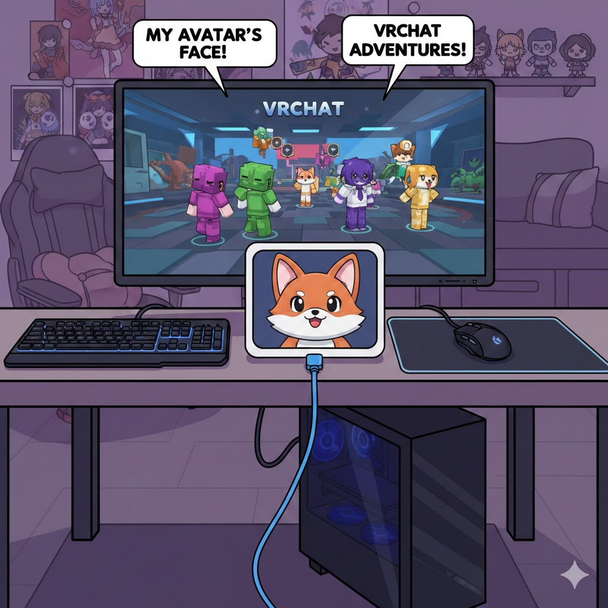
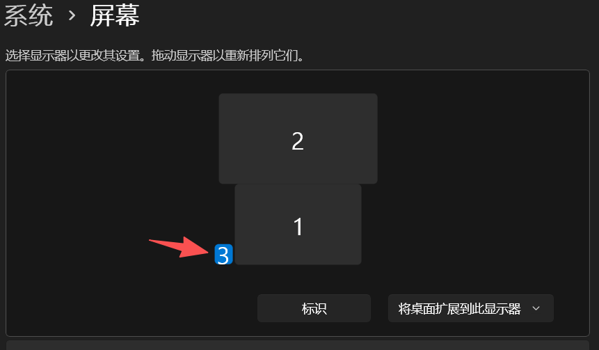
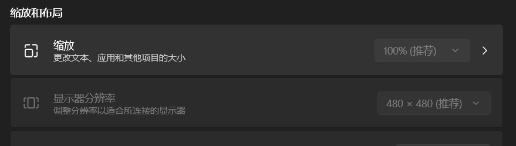
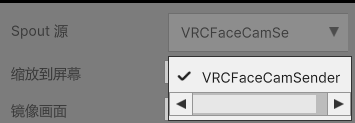

# VRChat Face Mirror Viewer

**专为 VRChat Face Mirror Spout 流设计的简易 Spout 流查看器。 推荐在多显示器环境下运行，最适合 1:1 比例的方形显示设备。**

---

# 使用例

1. PC玩家独立表情小屏

方便PC玩家在独立的小屏上查看自己Avatar的表情

 

*（本图片由AI 超随意生成）*

方案：
 买一个差不多的小屏作为副屏。
 或者使用现成的手机平板之类的连接电脑作为副屏。（比如可以通过 SpaceDesk 软件或部分支持拓展屏的远程桌面工具等。）

 我选择的是一款USB2.0连接，480 * 480 带触摸的小屏，仅需要USB2.0即可驱动，但是需要找卖家要专门的驱动才行。没驱动只有喇叭和触摸能用。（还带tf卡插槽可以播放之类的功能）他家还有个800 * 800的圆形的，也买了，除了形状和没触摸其他方面体验差不多。
 
 当然也可以选用正经的具有HDMI等显示信号接口的显示屏。

 

 

开启VRChat里的表情镜子Spout输出功能。大设置菜单的镜子设置页面中最下。

运行本程序，拖到副屏上并全屏。

选择显示名叫VRCFaceCamSender的Spout源。

 

软件就会显示这个表情镜子的画面，在副屏上全屏即可。

---

# 其他说明

- 截屏保存目录在exe文件的根目录。
- 也可以读其他spout流，比如VRChat直播相机。
- 使用Unity6，DX12,可能不兼容不支持DX12的设备。

---

# 鸣谢

- [KlakSpout](https://github.com/keijiro/KlakSpout) - 提供的代码参考

- [spout-ndi-viewer](https://github.com/sugi-cho/spout-ndi-viewer) - 提供的代码参考

