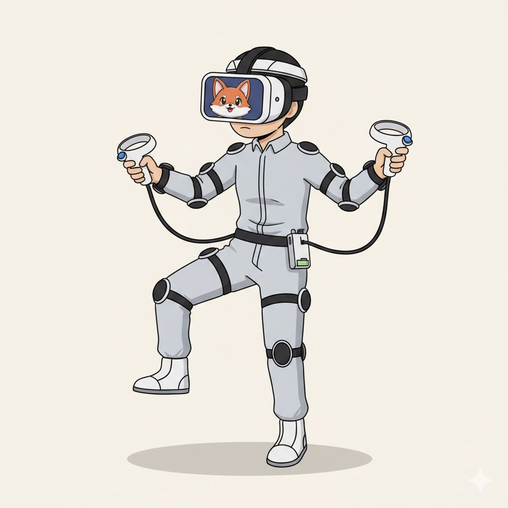

# VRChat Face Mirror Viewer

**专为 VRChat Face Mirror Spout 流设计的简易 Spout 流查看器。 推荐在多显示器环境下运行，最适合 1:1 比例的方形显示设备。**

# 使用例

VRChat更新了把表情镜子画面作为Spout输出的功能。所以，I have a **副屏**, I have a **表情镜子**，Boom，**表情镜子副屏。**

1. PC玩家独立表情小屏

方便PC玩家在独立的小屏上查看自己Avatar的表情

 

- 方案：
 买一个差不多的小屏作为副屏。
 或者使用现成的手机平板之类的连接电脑作为副屏。（比如可以通过 SpaceDesk 软件）

 我选择的是一款USB2.0连接，480 * 480 带触摸的小屏，仅需要USB2.0即可驱动，但是需要找卖家要专门的驱动才行。没驱动只有喇叭和触摸能用。（还带tf卡插槽可以播放之类的功能）他家还有个800 * 800的圆形的，也买了，除了形状和没触摸其他方面体验差不多。
 
 当然也可以选用正经的具有HDMI等显示信号接口的显示屏。

 

 

开启VRChat里的表情镜子Spout输出功能。

运行一个可以查看Spout源的程序在副屏上。

选择显示名叫VRCFaceCamSender的Spout源

 

软件就会显示这个表情镜子的画面，在副屏上全屏即可。

---

1. ~~VR玩家线下发癫~~

~~方便VR玩家在脸上佩戴自己的Avatar形象~~

 

- 方案：
 使用无线连接的拓展屏，如ipad搭配duet diaplay app，佩戴在脸上作为副屏

1. ~~VRChat玩家宣布统治世界时使用~~

 

- ~~方案：~~
 ~~首先统治世界，将全球的显示设备信号接入PC作为副屏（Spout属于GPU显存帧共享机制，仅能在VRchat运行中的PC上传输画面无法跨机）~~

 开启VRChat里的表情镜子Spout输出功能。
运行VRChat Face Mirror Viewer。
选择显示名叫VRCFaceCamSender的Spout源

 

软件就会显示这个表情镜子的画面，在副屏上选择全屏即可